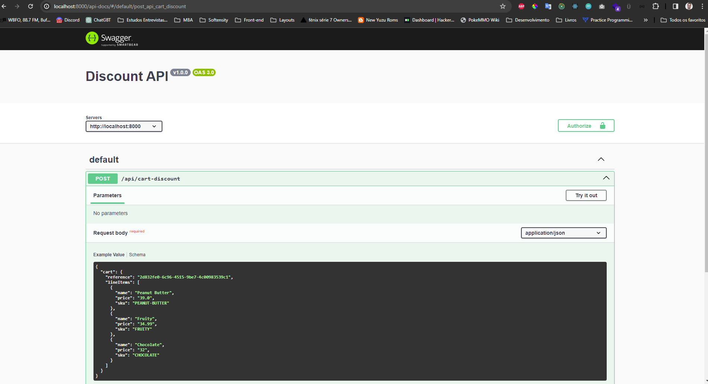
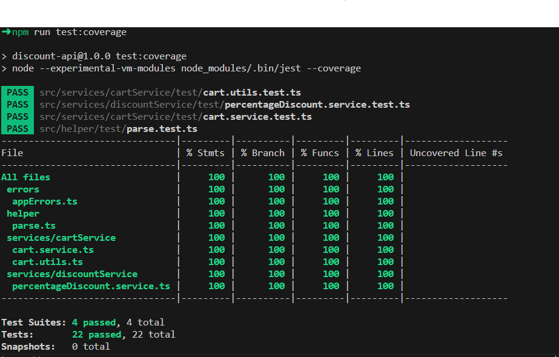

# Discount API Documentation

Welcome to the Discount API, a Node.js and Express-based solution designed to apply discounts to shopping carts. Utilizing TypeScript, this API is built with modern development practices and integrates leading libraries for optimal performance and ease of maintenance.

## Integrated Libraries

This project incorporates a robust set of tools to ensure quality and efficiency:

- **Nodemon**: Simplifies development by automatically restarting the server after file changes.
- **Swagger**: Provides interactive API documentation, making testing straightforward.
- **Jest**: Offers comprehensive testing capabilities to ensure reliability.
- **Zod**: Enables robust input validation through TypeScript-friendly schemas.
- **ESLint**: Enforces coding standards for cleaner, more consistent code.
- **Prettier**: Automatically formats code for improved readability.
- **Husky**: Utilizes Git hooks to automate linting and testing before commits.

## Quick Start Guide

### Installation

Install project dependencies by running:

```bash
npm install
```

### Development Server

To launch the development server, execute:

```bash
npm run dev
```

This command initializes the server and automatically opens a new browser tab to the project.

#### API Documentation

Access the Swagger-generated API documentation at **/api-docs** for interactive testing and exploration of available endpoints.


### Building the Project

Compile the project for production with:

```bash
npm run build
```

### Testing

Execute project tests using the following commands:

#### Run All Tests

```bash
npm run test
```

#### Coverage Report

```bash
npm run test:coverage
```



### Commit Guidelines

The project employs Husky to ensure code quality and adherence to standards. Commits trigger pre-commit hooks that perform lint checks and run tests, ensuring only quality code is pushed.

## Project Architecture

Adhering to SOLID principles and a modular architecture, the project is organized as follows:

```
src/
│
├── api/ - API controllers and validation schemas
├── configuration/ - Application settings and configurations
├── middleware/ - Request validation and error handling middleware
├── routes/ - Endpoint definitions
├── services/ - Business logic implementation
├── app.js - Application setup
└── server.js - Server entry point
```

## API Purpose

The API provides a single endpoint, **/api/cart-discount**, accepting POST requests with a shopping cart payload. It applies discounts based on predefined rules and returns the updated cart.

### Request Example

```json
{
  "cart": {
    "reference": "2d832fe0-6c96-4515-9be7-4c00983539c1",
    "lineItems": [
      {
        "name": "Peanut Butter",
        "price": "39.0",
        "sku": "PEANUT-BUTTER"
      },
      {
        "name": "Fruity",
        "price": "34.99",
        "sku": "FRUITY"
      },
      {
        "name": "Chocolate",
        "price": "32",
        "sku": "CHOCOLATE"
      }
    ]
  }
}
```

### Response Example

Returns the cart with applied discounts:

```json
{
  "cart": {
    "reference": "2d832fe0-6c96-4515-9be7-4c00983539c1",
    "lineItems": [
      {
        "name": "Peanut Butter",
        "price": "39",
        "sku": "PEANUT-BUTTER",
        "discountPrice": "39"
      },
      {
        "name": "Fruity",
        "price": "34.99",
        "sku": "FRUITY",
        "discountPrice": "34.99"
      },
      {
        "name": "Chocolate",
        "price": "32",
        "sku": "CHOCOLATE",
        "discountPrice": "16"
      }
    ],
    "totalDiscountCart": 89.99
  }
}
```

## Solution Approach

The solution leverages **discountService** and **cartService** to apply discounts dynamically based on configurations. It emphasizes functional programming for ease of testing and readability.

### Key Features

- **Discount Service**: Implements discount strategies with a factory pattern, facilitating easy extension.
- **Cart Service**: Utilizes functional programming principles to apply discounts, optimizing performance with data structures like `Set` for efficient searches.

## Standards and Best Practices

Husky automates code quality checks, ensuring adherence to established coding standards and best practices, including commit message formatting and code linting.
